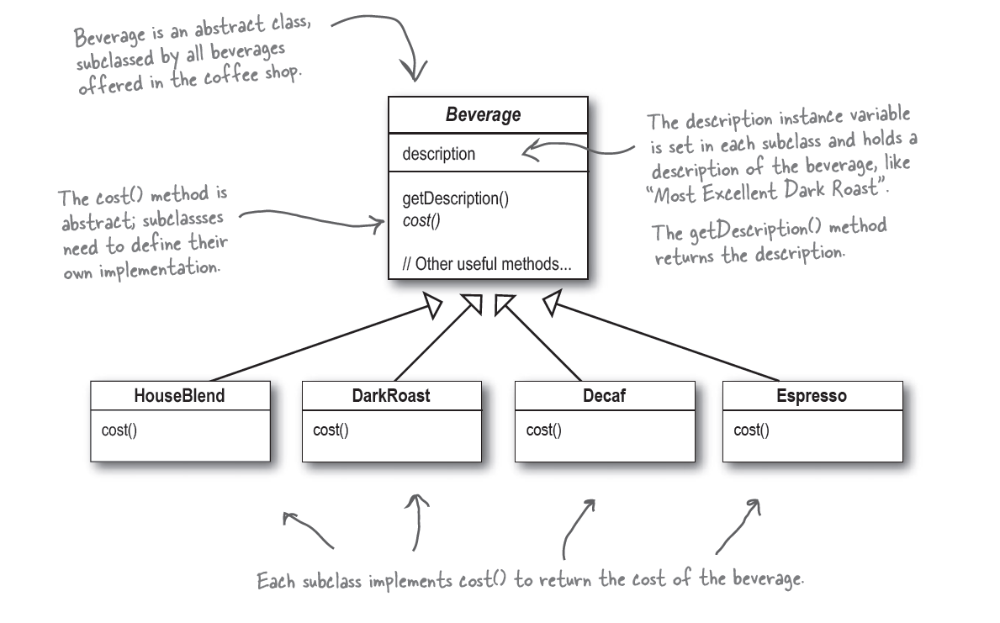
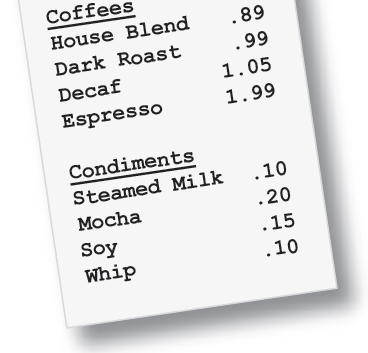

#  The Decorator Pattern
---
Assume you are operating a coffee shop that offers the following beverages: HouseBlend, DarkRoast, etc. For tracking the beverages, you created an `abstract class Beverage` as can been seen in the figure below that is extended by specific beverage classes and also each beverage includes `description` and a `cost` as seen in the figure below.



You decided to add different condiments in your coffees, such as steamed milk, whipped milk, soy, etc. You could introduce these condiments in your code by introducting classes such as `DarkRoastWithSteamedMilk`, `DecafWithWhippedMilk`, etc. Among others, such an approach is not satisfactory, since it would bloat our codebase with extra classes.

Therefore, we are going to use the **decorator pattern**. Fill up the remaining code or create more classes if needed so you get the following results when you execute the `main` method. 
```Java
Espresso $1.99
Espresso, Soy, Mocha, Steamed Milk, Whipped Milk $2.5400000000000004
Decaf $1.05
Decaf, Steamed Milk, Whipped Milk, Whipped Milk, Soy $1.5000000000000002
```

Use the following prices:




Try to understand what happens when we calculate some cost, e.g., `new WhippedMilk(new Soy(new Steamed Milk(new DarkRoast()))).cost()`.


 
(This example was taken from "Head First Design Patterns" by Elisabeth Freeman and Kathy Sierra)